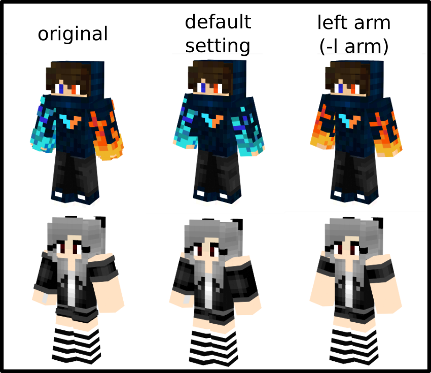
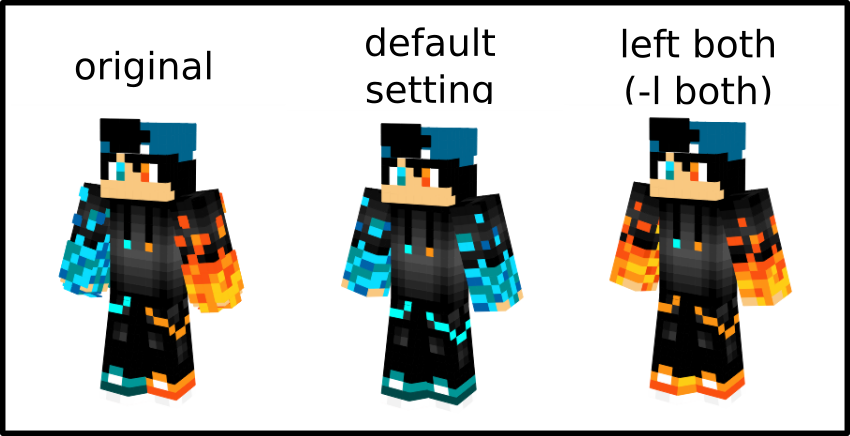
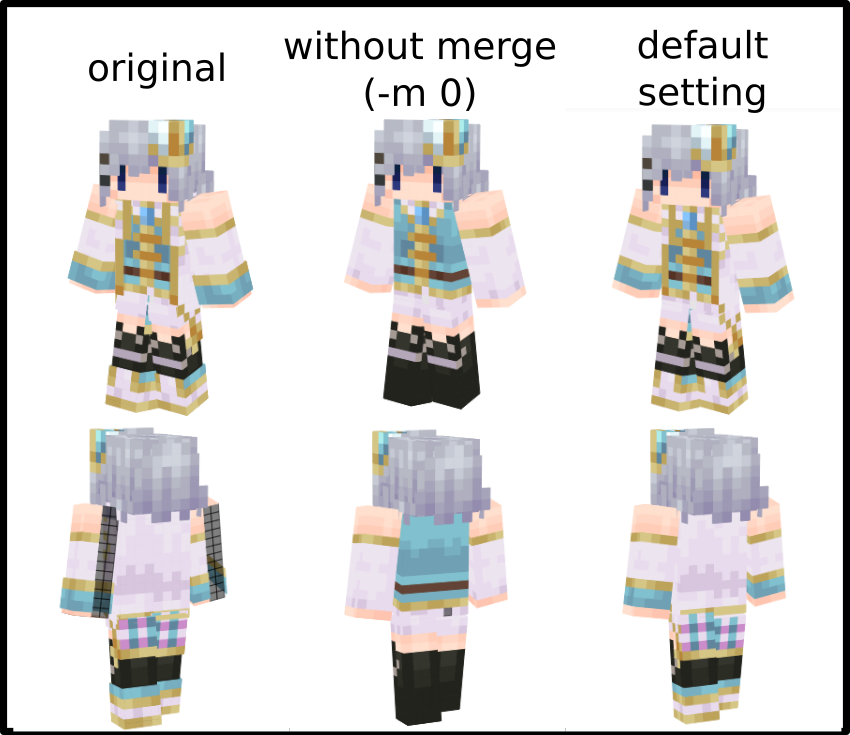
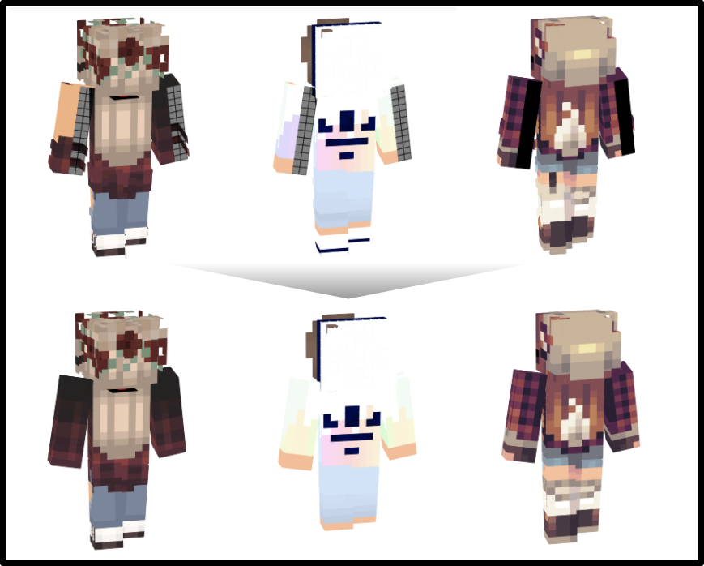

Skin Converter
======================

**Requirements:** Python, Python Imaging Library (PIL), Argparse

Simple batch conversion tools for migration between compatible skin formats.


convert.py
----
Convert format 1.8 to format 1.7, with new features and options.

### Features
- Auto detect slimmer arm.
- Fill blank voxel up which is slimmer arm.
- Merge overlay down
- Replace right leg/arm by left.
- Functions are selectable.

**Usage:** `./convert.py [-h] [-f {0,1}] [-l {arm,leg,both}] [-k {0,1}] [-m {0,1}] source`
( `python3 convert.py [-h] [-f {0,1}] [-l {arm,leg,both}] [-k {0,1}] [-m {0,1}] source` )

### Using Left Arm


### Using Left Arm And Leg


### Merge Down


### Slim Arm Repaired


### Demo Images
The skins had using to demonstrates are render by: http://minecraft.novaskin.me/
[](https://creativecommons.org/licenses/by-nc-sa/3.0/)

format17.py
-----------

Convert format 1.8 to format 1.7

**Usage:** format17.py \<file|dir>

**Example:** Convert a single file in the current working directory.

```
python format17.py character.png
```
format18.py
-----------

Convert format 1.7 to format 1.8

**Usage:** format18.py \<file|dir>

**Example:** Convert all compatible files within a directory, non-recursively.

```
python format18.py skins/textures
```

⚠️Notes
-----

Output images are RGBA mode PNG and will **overwrite the original image without warning.**
Be sure you have a backup just in case things go wrong. 